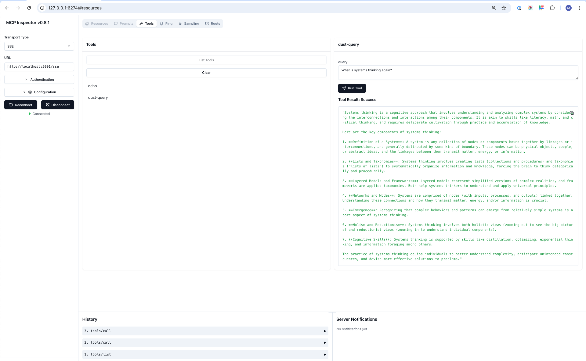

# MCP Dust Server

This repository contains an implementation of a Model Context Protocol (MCP) server designed to interact with Dust agents. The server is separated into two main components: the MCP server (which handles Dust API interactions) and the MCP test client (which provides a web interface for testing).

## Features

- Separate MCP server and test client components
- Interaction with Dust AI agents via the Dust API
- Real-time streaming responses using Server-Sent Events (SSE) and HTTP Stream Transport
- Full JSON-RPC 2.0 support with 'initialize', 'message', 'terminate', and 'run' methods
- Direct tool execution via the 'run' method for simplified client integration
- Robust session management and context preservation
- Secure API key handling with PII masking in logs
- Heartbeat mechanism to maintain persistent connections
- Automatic reconnection for dropped connections
- Comprehensive error handling and reporting
- Support for the latest MCP specification (2025-03-26)
- Status endpoints for monitoring and health checks

## Installation

### Prerequisites
- Node.js (recommended: latest LTS version installed via [nvm](https://github.com/nvm-sh/nvm))
- npm (comes with Node.js)
- TypeScript

### Steps
1. Clone the repository:
   ```bash
   git clone https://github.com/ma3u/mcp-dust-server.git
   cd mcp-dust-server
   ```

2. Install dependencies:
   ```bash
   npm install
   ```

3. Configure environment variables:
   Create a `.env` file in the root directory based on `.env.example`:

   ```env
   # Startup Mode (server, client, or both)
   START_MODE=both
   
   # MCP Server Configuration
   MCP_NAME=Dust MCP Server JS
   MCP_HOST=127.0.0.1
   MCP_PORT=5001
   MCP_TIMEOUT=30 # seconds
   
   # MCP Test Client Configuration
   CLIENT_HOST=127.0.0.1
   CLIENT_PORT=5002
   
   # Dust API Configuration
   DUST_API_KEY=your_dust_api_key_here
   DUST_WORKSPACE_ID=your_workspace_id_here
   DUST_AGENT_ID=your_agent_id_here
   DUST_DOMAIN=https://dust.tt
   
   # User Context Information (used in Dust API requests)
   DUST_USERNAME=your_username
   DUST_EMAIL=your_email@example.com
   DUST_FULLNAME=Your Full Name
   DUST_TIMEZONE=Europe/Berlin
   ```


## Starting the Server and Client

You can run the MCP server and test client separately or together. The project provides several npm scripts for different scenarios:

### Development Mode

1. **Start both Server and Client**:
   ```bash
   npm run dev
   ```


2. **Start MCP Server only**:
   ```bash
   npm run dev:server
   ```


3. **Start Test Client only**:
   ```bash
   npm run dev:client
   ```


### Production Mode

1. **Start both Server and Client**:
   ```bash
   npm run start
   ```


2. **Start MCP Server only**:
   ```bash
   npm run start:server
   ```


3. **Start Test Client only**:
   ```bash
   npm run start:client
   ```


### Expected Output
If everything is configured correctly, you should see output similar to:

**For the MCP Server**:

```text
MCP Server running on http://127.0.0.1:5001 (timeout: 30s)
Server name: Dust MCP Bridge
Dust workspace: your_workspace_id
Dust agent: your_agent_id
```

**For the Test Client**:

```text
MCP Test Client running on http://127.0.0.1:5002
```

---

## API Endpoints

The server provides several endpoints for monitoring and health checks:

### Health Check Endpoints

- **GET /health**: Returns the server's health status
  ```json
  {
    "status": "healthy",
    "version": "1.0.0",
    "timestamp": "2025-04-02T16:34:16.989Z",
    "component": "MCP Server",
    "activeSessions": 0
  }
  ```

- **GET /ready**: Indicates if the server is ready to accept connections
  ```json
  {
    "status": "ready",
    "version": "1.0.0",
    "timestamp": "2025-04-02T16:34:16.989Z"
  }
  ```

- **GET /live**: Indicates if the server is alive
  ```json
  {
    "status": "alive",
    "uptime": 123.45,
    "timestamp": "2025-04-02T16:34:16.989Z"
  }
  ```

- **GET /api/v1/status**: Returns operational status and configuration details
  ```json
  {
    "status": "operational",
    "version": "1.0.0",
    "workspace": "11453f1c9e",
    "agent": "8x9nuWdMnR",
    "uptime": 123.45
  }
  ```

### MCP Protocol Endpoints

- **GET /sse**: Server-Sent Events endpoint for real-time streaming
- **POST /stream**: HTTP Stream Transport endpoint according to MCP specification
- **POST /messages**: JSON-RPC endpoint for non-streaming MCP messages

## Integration

### Windsurf IDE Configuration

To integrate the Dust MCP Server with Windsurf IDE, update the configuration file `~/.codeium/windsurf/mcp_config.json`:

```json
{
  "mcpServers": {
    "dust-mcp": {
      "command": "npm",
      "args": [
        "run",
        "start:server"
      ],
      "env": {
        "DUST_API_KEY": "${YOUR_API_KEY}",
        "DUST_WORKSPACE_ID": "${YOUR_WORKSPACE_ID}",
        "DUST_AGENT_ID": "${YOUR_AGENT_ID}"
      },
      "host": "127.0.0.1",
      "port": 5001,
      "timeout": 30000
    }
  }
}
```

### Claude Desktop Integration

To integrate the Dust MCP Server with Claude Desktop, update its configuration file:

```json
{
  "mcpServers": {
    "dust-agent": {
      "command": "npm",
      "args": [
        "run",
        "start:server"
      ],
      "cwd": "path/to/mcp-dust-server",
      "host": "127.0.0.1",
      "port": 5001,
      "timeout": 30000,
      "env": {
        "DUST_API_KEY": "${YOUR_API_KEY}",
        "DUST_WORKSPACE_ID": "${YOUR_WORKSPACE_ID}",
        "DUST_AGENT_ID": "${YOUR_AGENT_ID}"
      }
    }
  }
}
```


## Testing

### Web Client Testing

The project includes a web-based test client accessible at `http://localhost:5002` (or your configured CLIENT_PORT) when you run the client component. This web interface allows you to:



1. Connect to the MCP server via SSE with automatic reconnection
2. Send test echo messages to verify connectivity
3. Send queries to your Dust agent and receive streaming responses
4. View responses in real-time with detailed logging
5. Monitor connection status with visual indicators

### Command-Line Testing

The project includes command-line test scripts for testing different aspects of the server:

1. **Dust API Test Client**:

   ```bash
   npm run test:dust-client
   ```

   Tests direct interaction with the Dust API without going through the MCP server.

2. **JSON-RPC Run Method Test**:

   ```bash
   npm run test:run-method
   ```

   Tests the JSON-RPC 'run' method implementation for direct tool execution via the HTTP Stream transport.

### Connection Status Indicators

The test client includes visual indicators for connection status:

- **Connected**: Green status indicator, all action buttons enabled
- **Disconnected**: Red status indicator, action buttons disabled
- **Pending**: Yellow status indicator, action buttons disabled

### Heartbeat Mechanism

The server implements a heartbeat mechanism that sends periodic messages to keep the SSE connection alive. This helps prevent timeouts and ensures a stable connection between the client and server.

## API Documentation

### MCP Server Endpoints

- `GET /health` - Server health check endpoint
- `GET /live` - Server liveness check endpoint
- `GET /ready` - Server readiness check endpoint
- `GET /sse` - Establish SSE connection with automatic heartbeat
- `POST /stream` - HTTP Stream Transport endpoint for bidirectional communication
  - Supports JSON-RPC methods: 'initialize', 'message', 'terminate', and 'run'
  - Direct tool execution via the 'run' method
- `GET /debug/sessions` - View active session information (development only)
- `GET /debug/connections` - View active connection information (development only)

### Transport Mechanisms

The server supports two transport mechanisms:

1. **SSE (Server-Sent Events)**: Used for real-time streaming from server to client
   - Automatic reconnection on connection loss
   - Heartbeat mechanism to prevent timeouts
   - Session tracking for context preservation

2. **HTTP Stream Transport**: Used for bidirectional communication
   - Chunked encoding for streaming responses
   - Session ID tracking via headers
   - Proper CORS configuration for cross-origin requests

### MCP Tools

1. **echo**
   - Description: Echoes back the provided message (for testing)
   - Parameters: `message` (string)
   - Access via: Tool call or direct 'run' method

2. **dust-query**
   - Description: Send a query to your Dust AI agent
   - Parameters: `query` (string)
   - Access via: Tool call or direct 'run' method

## Development

### Project Structure

```text
src/
├── mcp-server/
│   ├── index.ts            # MCP server entry point
│   └── server.ts           # MCP server implementation
├── mcp-client/
│   └── client-server.ts    # Test client implementation
├── utils/
│   ├── dust-client.ts      # Dust API client wrapper
│   ├── dust-test-client.ts # Dust API test client
│   ├── test-run-method.ts  # JSON-RPC 'run' method test script
│   ├── secure-logger.ts    # PII-masking secure logger
│   ├── session-manager.ts  # Session management implementation
│   └── http-stream-transport.ts # HTTP Stream Transport implementation
├── index.ts               # Main entry point
└── types/
    └── index.ts           # TypeScript type definitions
public/
├── test-sse.html          # Web-based test client
├── styles.css             # Client styles
└── favicon.ico            # Site favicon
dist/                      # Compiled JavaScript output
tests/                     # Test suite
```

### Security Considerations

- **API Key Protection**: API keys are masked in logs to prevent accidental exposure
- **Session Management**: Sessions expire after inactivity to prevent resource leaks
- **CORS Configuration**: Proper CORS headers to control cross-origin requests
- **Input Validation**: All inputs are validated before processing
- **Error Handling**: Comprehensive error handling to prevent information leakage
- **Rate Limiting**: Basic rate limiting to prevent abuse


---

## License

This project is licensed under [MIT License](LICENSE).