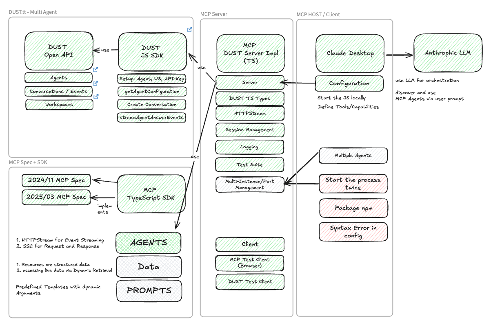
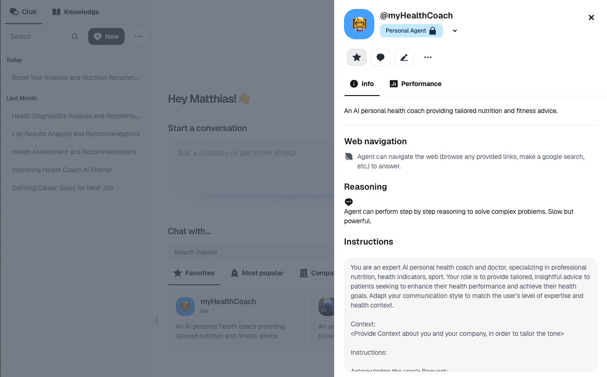

# MCP Dust Server

This repository contains an implementation of a Model Context Protocol (MCP) server designed to interact with Dust agents. The server is separated into two main components: the MCP server (which handles Dust API interactions) and the MCP test client (which provides a web interface for testing).

## Table of Contents

- [MCP Dust Server](#mcp-dust-server)
  - [Table of Contents](#table-of-contents)
  - [Features](#features)
  - [Architecture](#architecture)
  - [Dust.tt Agentic AI](#dusttt-agentic-ai)
  - [Installation](#installation)
    - [Prerequisites](#prerequisites)
    - [Steps](#steps)
  - [Starting the Server and Client](#starting-the-server-and-client)
    - [Expected Output](#expected-output)
  - [API Endpoints](#api-endpoints)
  - [Debugging](#debugging)
  - [Integration](#integration)
    - [Windsurf IDE Configuration](#windsurf-ide-configuration)
    - [Claude Desktop Integration](#claude-desktop-integration)
  - [Testing](#testing)
  - [API Overview](#api-overview)
  - [Developer Documentation](#developer-documentation)
  - [License](#license)

## Features

- Separate MCP server and test client components
- Interaction with Dust AI agents via the Dust API
- Real-time streaming responses using Server-Sent Events (SSE) and HTTP Stream Transport
- Full JSON-RPC 2.0 support with 'initialize', 'message', 'terminate', and 'run' methods
- Direct tool execution via the 'run' method for simplified client integration
- Robust session management and context preservation
- Secure API key handling with PII masking in logs
- Heartbeat mechanism to maintain persistent connections
- Automatic reconnection for dropped connections
- Comprehensive error handling and reporting
- Support for the latest MCP specification (2025-03-26)
- Status endpoints for monitoring and health checks

## Architecture

The MCP Dust Server is built using the following components:



**Figure 1:** MCP Server Architecture showing the server and client components

1. **MCP Server (server.ts)**:

   - Handles MCP protocol interactions with Dust API
   - Manages session state and context
   - Implements the full MCP lifecycle (initialize, message, terminate)
   - Supports both SSE and HTTP Stream Transport
   - Provides status endpoints for monitoring

2. **MCP Test Client (client.ts)**:
   - Provides a web interface for testing
   - Allows interaction with the MCP server
   - Supports real-time streaming and debugging
   - Includes session management and connection tracking

## Dust.tt Agentic AI

Dust.tt is a platform designed to help organizations build and deploy custom AI agents tailored to their specific needs. It integrates advanced AI models, such as GPT-4, Claude, Gemini, and Mistral, with enterprise-grade security features to streamline workflows, automate tasks, and enhance productivity across various business functions.



**Figure 2:** Screenshot of the Dust.tt platform interface showing agent capabilities

**Custom AI Agents**: Personalized Agents: Create agents with custom instructions and tools, tailored to team or individual needs.

**Company Context**: Integrate agents with internal tools like Notion, Slack, GitHub, or external APIs for seamless access to company data.

**Multi-Agent Workflows**: Combine and chain multiple agents, each with unique capabilities, in a single workflow.

**Integration with Data Sources**: Data Connections: Connect agents to data from SharePoint, Zendesk, Jira, Salesforce, Snowflake, and more.

**Dynamic Querying**: Use agents to analyze spreadsheets, databases, and warehouses with natural language or SQL queries.

**Real-Time Updates**: Sync company knowledge continuously for up-to-date responses.

**Open Source**: Available on [GitHub](https://github.com/ma3u/mcp-dust-server) under the MIT license. With a big community of users and developers.

**Hosting**: SaaS or own hosting option on your own server

## Installation

### Prerequisites
- Node.js (recommended: latest LTS version installed via [nvm](https://github.com/nvm-sh/nvm))
- npm (comes with Node.js)
- TypeScript

### Steps
1. Clone the repository:
   ```bash
   git clone https://github.com/ma3u/mcp-dust-server.git
   cd mcp-dust-server
   ```

2. Install dependencies:
   ```bash
   npm install
   ```

3. Configure environment variables:
   Create a `.env` file in the root directory based on `.env.example`:

   ```env
   # Startup Mode (server, client, or both)
   START_MODE=both
   
   # MCP Server Configuration
   MCP_NAME=Dust MCP Server JS
   MCP_HOST=127.0.0.1
   MCP_PORT=5001
   MCP_TIMEOUT=30 # seconds
   
   # MCP Test Client Configuration
   CLIENT_HOST=127.0.0.1
   CLIENT_PORT=6001
   
   # Dust API Configuration
   DUST_API_KEY=your_dust_api_key_here
   DUST_WORKSPACE_ID=your_workspace_id_here
   DUST_AGENT_ID=your_agent_id_here
   DUST_DOMAIN=https://dust.tt
   
   # User Context Information (used in Dust API requests)
   DUST_USERNAME=your_username
   DUST_EMAIL=your_email@example.com
   DUST_FULLNAME=Your Full Name
   DUST_TIMEZONE=Europe/Berlin
   ```


## Starting the Server and Client

You can run the MCP server and test client separately or together. The project provides several npm scripts for different scenarios:

1. **Start both Server and Client**:
   ```bash
   npm run start
   ```


2. **Start MCP Server only**:
   ```bash
   npm run start:server
   ```


3. **Start Test Client only**:
   ```bash
   npm run start:client
   ```


### Expected Output
If everything is configured correctly, you should see output similar to:

**For the MCP Server**:

```text
MCP Server running on http://127.0.0.1:5001 (timeout: 30s)
Server name: Dust MCP Bridge
Dust workspace: your_workspace_id
Dust agent: your_agent_id
```

**For the Test Client**:

```text
MCP Test Client running on http://127.0.0.1:6001
```

---

## API Endpoints

The server provides several endpoints for health checks and MCP protocol communication. For detailed API documentation, please refer to the [Developer Documentation](public/DEVELOPERS.md).

Key endpoints include:

- **Health Checks**: `/health`, `/ready`, `/live`
- **MCP Protocol**: `/sse` (Server-Sent Events), `/stream` (HTTP Stream Transport)

## Debugging

For detailed information about debugging tools and techniques, including the MCP Inspector, please refer to the [Developer Documentation](public/DEVELOPERS.md).

## Integration

### Windsurf IDE Configuration

To integrate the Dust MCP Server with Windsurf IDE, update the configuration file `~/.codeium/windsurf/mcp_config.json`:

```json
{
  "mcpServers": {
    "dust-mcp": {
      "command": "npm",
      "args": [
        "run",
        "start:server"
      ],
      "env": {
        "DUST_API_KEY": "${YOUR_API_KEY}",
        "DUST_WORKSPACE_ID": "${YOUR_WORKSPACE_ID}",
        "DUST_AGENT_ID": "${YOUR_AGENT_ID}"
      },
      "host": "127.0.0.1",
      "port": 5001,
      "timeout": 30000
    }
  }
}
```

### Claude Desktop Integration

To integrate the Dust MCP Server with Claude Desktop, update its configuration file:

```json
{
  "mcpServers": {
    "dust-agent": {
      "command": "npm",
      "args": [
        "run",
        "start:server"
      ],
      "cwd": "path/to/mcp-dust-server",
      "host": "127.0.0.1",
      "port": 5001,
      "timeout": 30000,
      "env": {
        "DUST_API_KEY": "${YOUR_API_KEY}",
        "DUST_WORKSPACE_ID": "${YOUR_WORKSPACE_ID}",
        "DUST_AGENT_ID": "${YOUR_AGENT_ID}"
      }
    }
  }
}
```


## Testing

The project includes both web-based and command-line testing tools. For detailed testing information, please refer to the [Developer Documentation](public/DEVELOPERS.md).

The web-based test client is accessible at `http://localhost:6001` when you run the client component, allowing you to interact with your Dust agent and test the MCP server functionality.

## API Overview

The server provides several endpoints for health checks and MCP protocol communication. For detailed API documentation, please refer to the [Developer Documentation](public/DEVELOPERS.md).

## Developer Documentation

For detailed technical information, including project structure, API documentation, debugging tools, and security considerations, please refer to the [Developer Documentation](public/DEVELOPERS.md).


---

## License

This project is licensed under [MIT License](LICENSE).